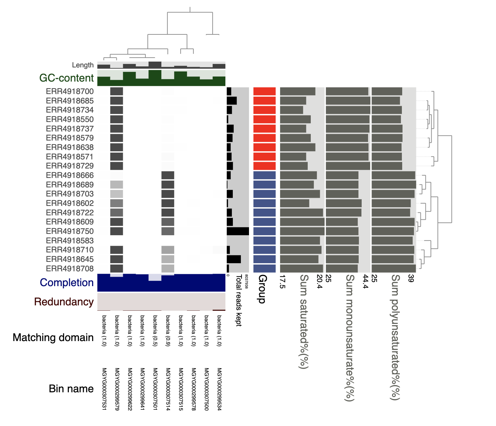
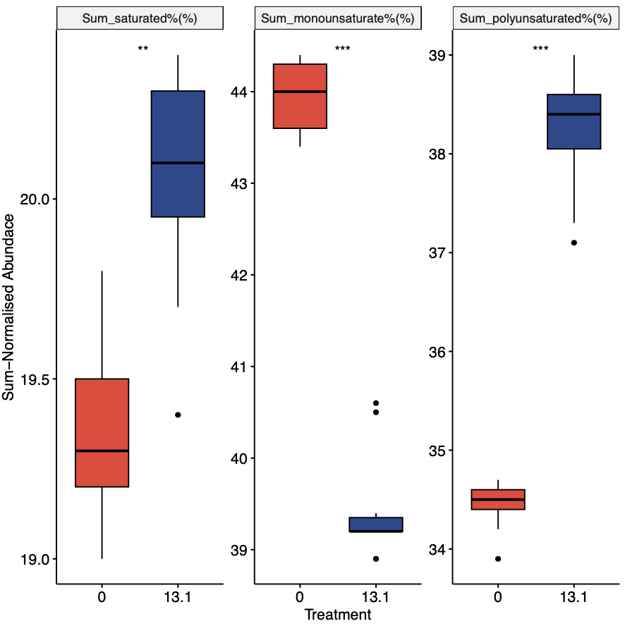
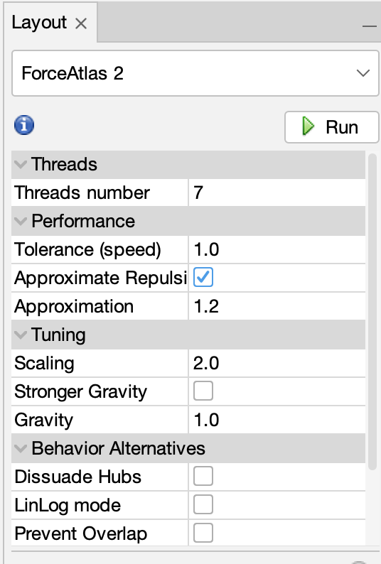
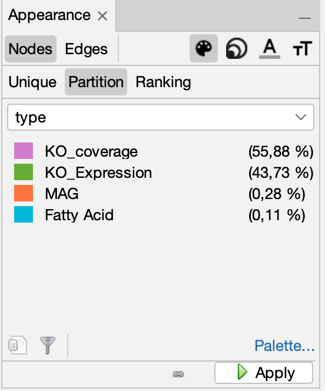
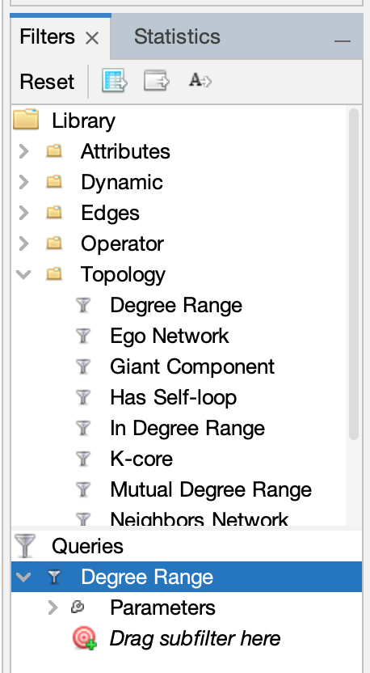
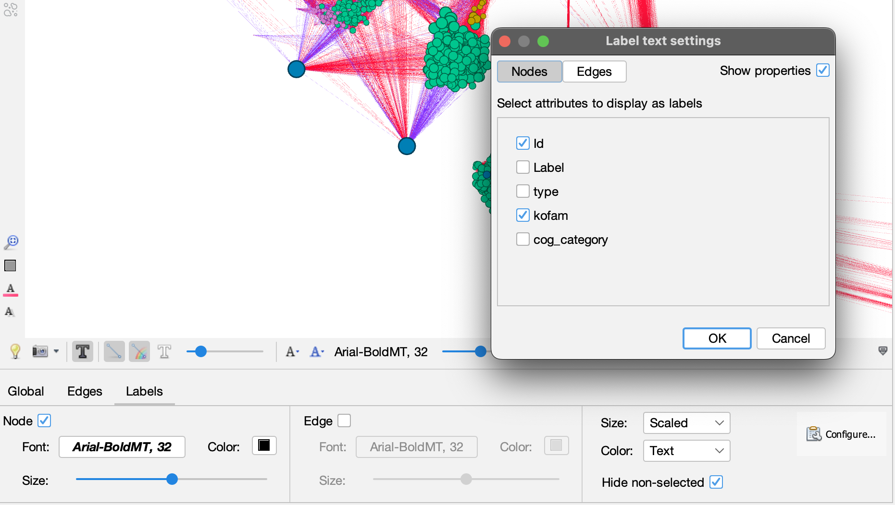
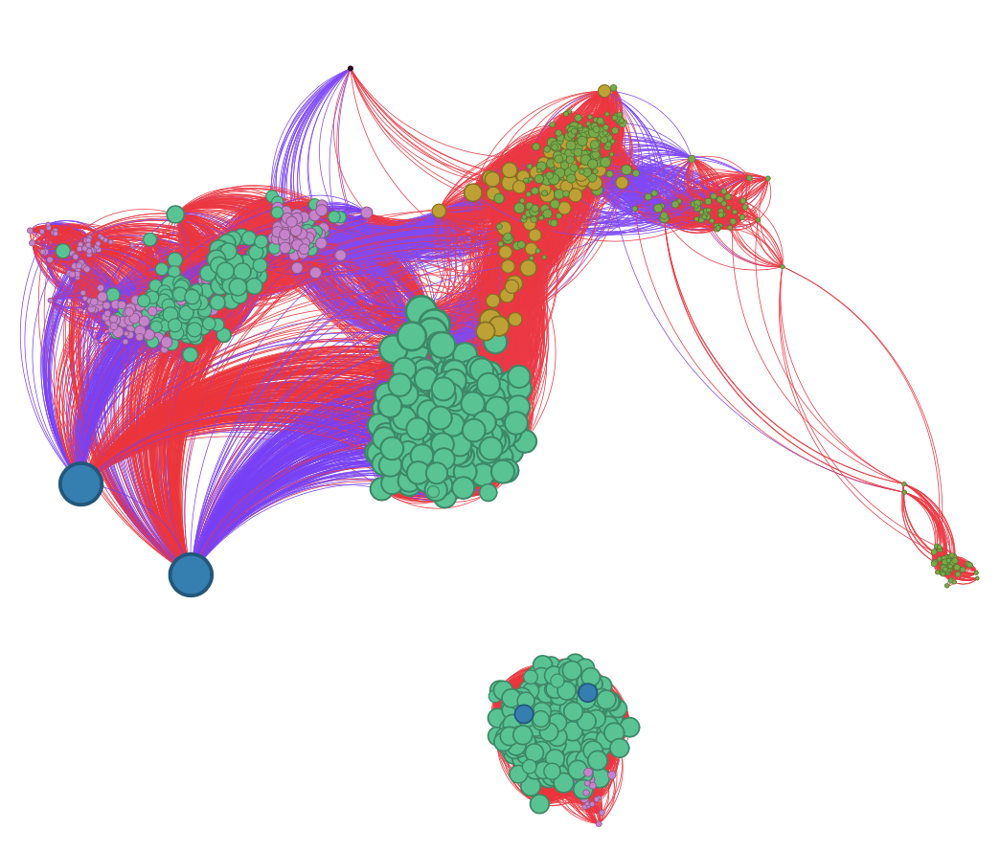

# Using Anvi'o for Genome-Resolved Metagenomics and other 'omics

## Introduction
Anvi'o is a powerful tool for analyzing metagenomic data and performing genome-resolved metagenomics. In this guide, we will walk through the steps to utilize Anvi'o for a functional metagenomics analysis.

## Installation
To get started with Anvi'o, you need to install it on your system. Follow the installation instructions provided on the official Anvi'o website.

For more information and detailed documentation, refer to the [Anvi'o documentation](https://merenlab.org/software/anvio/).

## Data Preparation
Before running Anvi'o, make sure you have the necessary metagenomic data ready. In our case, we use an EU-based data portal for multi omics analysis of host-microbe interactions in domesticated chicken and Atlantic salmon. This portal includes raw sequencing reads, assembly files, and any other relevant data for your analysis.

For more information and detailed documentation, refer to the [HoloFood Data portal](https://www.holofooddata.org/).

From the portal we can get ENA accessions and MAGs. Now lets download samples and the MAGs.

```bash
# Get samples
bash get_data.sh SAMPLES.txt

# Get MAGs (sorry for the ugly code)
while IFS= read -r genome; do
    # Process each genome here 
    echo "Downloading MAG: $genome"
    wget https://ftp.ebi.ac.uk/pub/databases/metagenomics/mgnify_genomes/non-model-fish-gut/v2.0/species_catalogue/MGYG0003075/"$genome"/genome/"$genome".fna
    wget https://ftp.ebi.ac.uk/pub/databases/metagenomics/mgnify_genomes/non-model-fish-gut/v2.0/species_catalogue/MGYG0002995/"$genome"/genome/"$genome".fna
    wget https://ftp.ebi.ac.uk/pub/databases/metagenomics/mgnify_genomes/non-model-fish-gut/v2.0/species_catalogue/MGYG0002996/"$genome"/genome/"$genome".fna
done < MAGs.txt
```

Now we will use anvi'o to get functional and taxonomic information, and microbial dynamics across samples. In short, we will do as below.
## Running Anvi'o
1. **Initialize Anvi'o:** Start by initializing Anvi'o and setting up your analysis environment.

    Use link to install anvi'o. [Anvi'o installation](https://anvio.org/install/).

2. **Import Data:** Import your metagenomic data into Anvi'o for analysis.

    ### Make contig database
    Lets start with merging all MAGs into one contig database (DB).
    ```bash
    cat *.fna > contigs-fixed.fa
    ```
    ...and index the contig database for re-mapping.
    ```bash
    bwa index contigs-fixed.fa
    ```
    Now lets make the anvi'o contig database from our HoloFood MAGs.
    ```bash
    anvi-gen-contigs-database -f contigs-fixed.fa -o ./CONTIGS.db -n 'CONTIG DB for HoloFood MAGs'
    ```
    Now we can annotated all genes in thee contig database, using NCBI COG and KEGG koFAMs.
    ```bash
    # NCBI COGs
    anvi-setup-ncbi-cogs
    anvi-run-ncbi-cogs -c CONTIGS.db

    # KEGG koFAM
    anvi-setup-kegg-data
    anvi-run-kegg-kofams -c CONTIGS.db 

    # Annotation of marker genes with HMMs
    anvi-run-hmms -c CONTIGS.db
    ```

    ### Make profile database
    
    Now we need to make profiles for each sample to analyse MAG dynamics across samples.

    We need to ensure data quality of the downloaded data. Here we use fastp and bbmap. 

    ```bash
    mapfile -t FILES < SAMPLES.txt
    for file in "${FILES[@]}"
        do
        doQC.sh $file
        doRename.sh $file
    done
    ```

    Now we can map our samples to the MAG catalogue, using an old school loop. :yum:

    ```bash    
    mapfile -t FILES < SAMPLES.txt
    for sample in "${FILES[@]}"
        do    
        # Set the input file names based on the user input
        read1="renamed_filt_$sample_1.fastq.gz"
        read2="renamed_filt_$sample_2.fastq.gz"

        # Print the starting message
        echo "Starting genome-resolved metagenomics on: $sample"

        # Index contigs for profiling
        # Align reads to contigs using bwa
        echo "Alligning reads to contigs using BWA"
        mkdir $sample
        bwa mem -t 2 contigs-fixed.fa "$read1" "$read2" > $sample/$sample_aln_pe.sam

        # Convert SAM to BAM
        echo "convert SAM to BAM"
        samtools view -@ 2 -bS "$sample/$sample_aln_pe.sam" > "$sample/$sample_aln_pe.bam"

        # Initialize BAM file for anvi'o
        # Profile the BAM file using anvi'o

        # Finally, because single profiles are rarely used for genome binning or visualization,
        # and since the clustering step increases the profiling runtime for no good reason,
        # the default behavior of profiling is to not cluster contigs automatically.
        # However, if you are planning to work with single profiles,
        # and if you would like to visualize them using the interactive interface without any merging,
        # you can use the --cluster-contigs flag to initiate clustering of contigs.
        echo "start profiling"
        anvi-init-bam "$sample/$sample_aln_pe.bam" -o "$sample/$sample.bam"
        anvi-profile -i "$sample/$sample.bam" -c CONTIGS.db" -o "PROFILES/$sample/" -T 2 --cluster-contigs

        # Print the completion message
        echo "Done with: $sample"
    ```

    Now all single profiles has been made and we only need to merge them. :neckbeard:

    Which is an easy-peasy-one-liner. 

    ```bash
    anvi-merge -c CONTIGS.db PROFILES/*/PROFILE.db -o MERGED_PROFILES
    ```

    3. **Import MAGs from collections:** 

    Now we need to make and add a collection, to include our MAG information across contigs. The MAG information is stored in the header of the contigs, but we need them as splits. Therefore, we do some `anvi` and `awk` magic. 

    ```bash
    # Get splits and coverages from all contigs in your contig databases.
    anvi-export-splits-and-coverages -c CONTIGS.db -p MERGED_PROFILES/PROFILE.db
    # get split name and old mag name in to columns, using awk
    awk '{split($1, arr, "_"); print $1 "\t" arr[1]}' MERGED_PROFILES/MERGED_PROFILES-COVs.txt > MERGED_PROFILES/COLLECTION.txt
    ```
    Now include the collection to our CONTIG.db and PROFILE.db

    ```bash
    anvi-import-collection -p MERGED_PROFILES/PROFILE.db -c CONTIGS.db MERGED_PROFILES/COLLECTION.txt -C MAGs
    ```

    4. **Summarize and export Data:** Explore and visualize the genomic and metabolic information using Anvi'o's interactive interface.

    ```bash
    # Get functional annotations
    anvi-export-functions -c CONTIGS.db -o FUNCTIONS.txt
    # get coverage for each gene
    anvi-export-gene-coverage-and-detection -c CONTIGS.db -p PROFILE.db -O FUNCTIONS
    ```

    
    5. **Analyze and Interpret Results:** Analyze the MAGs to gain insights into the microbial community structure and function.

    Now we should be able to see an anvio illustatrion of our MAGs across samples with `anvi-interactive`. 
    ```bash
    anvi-interactive -c CONTIGS.db -p PROFILE.db -C MAGs
    ```

    Furthermore, we can add additional sample information, as in this case, we will add fatty acid measurements, and grouping (based on diet).
   
    ```bash
    anvi-import-misc-data view.txt \
                              -p PROFILE.db \
                              --target-data-table layers --just-do-it
    ```


    Now we can rerun the `anvi-interactive` code chunk to see additional data layers in anvi'o.    

    

    More importantly, we export all other data related to the MAGs across samples with a simple function, called `anvi-summarize`.

    ```bash
    anvi-summarize -c CONTIGS.db -p PROFILE.db -C MAGs
    ``` 

    A finalised repository with databases and summaries can be on [figshare](https://10.6084/m9.figshare.25997383)

    _Happy analyzing with Anvi'o!_

    -----

    ## Integrative Analysis in R based on anvi'o outputs.

    ### Getting started with R
    Now we will incrporate the information gotten from anvi'o with the metatranscriptome and fatty acid profiles, which can be found here on [figshare](https://10.6084/m9.figshare.25997398) or it can be found in the integration folder [folder](https://github.com/JacobAgerbo/MSMM_2024/tree/main/Integration)

    We will be using tidyverse in Rstudio. If R and Rstudio is not installed, be please install that using following [link](https://www.stat.colostate.edu/~jah/talks_public_html/isec2020/installRStudio.html).

    Let's install needed libraries.
    ```r
    if (!requireNamespace("BiocManager", quietly = TRUE)) {
    install.packages("BiocManager")
        }
    
    # List of libraries to be loaded
    libs <- c("tidyverse", "readxl", "ggpubr", "Hmisc", "hilldiv", "reshape2")

    # Check if each library is installed, if not, install quietly using BiocManager
    for (lib in libs) {
    if (!requireNamespace(lib, quietly = TRUE)) {
        BiocManager::install(lib, dependencies = TRUE)}
    library(lib, character.only = TRUE)
        }

    library(tidyverse)
    library(readxl)
    library(ggpubr)
    library(Hmisc)
    library(hilldiv)
    library(reshape2)
    ```

    ### Fatty acid profiles as phenotype

    So in this data, we have given some salmon blue mussels (either 0 % or 13.1 %). Lets see how this affect their fatty acid composition. 

    ```r
    FA <- read_excel("Fatty_Acids.xlsx")
    FA %>%
    mutate(Treatment = as.factor(Treatment)) %>%
    select(Treatment, contains("%")) %>%
    reshape2::melt() %>%
    ggboxplot(x = "Treatment",
                y = "value",
                fill = "Treatment") +
    facet_wrap(~variable, scales = "free_y") +
    stat_compare_means(label.x = 1.5, label = "p.signif") +
    scale_fill_manual(values = c("#eb4034", "#28478f")) +
    theme(legend.position = "none") +
    ylab("Sum-Normalised Abundace")
    ```
    

    As you might see, the diet seems to affect the composition of SFAs, MUFAs, and PUFAs. The fatty composition will be our phenotype in this analysis.

    ### Network for analysis association between MAGs, their KOs, metatransctriptome and fatty acids.

    Lets load metadata into Rstudio
    ```r
    md <- read_excel("metadata.xlsx")
    ```    

    Lets load Meta-Transcriptome into Rstudio

    This data is expression (TPM-normalised) of koFAMs in the metagenome, this will be ideal to start an investigation on assocation between MAG presence, expression and fatty acid accumuliation in the salmon.

    #### Load and filter metatranscriptome

    ```r
    MT <- read.csv("MetaTranscriptome.csv",
               row.names = 1)
    ```    

    So we only want to look on expression, which can be linked to the MAGs (some bacteria might not have been assembled, but still express RNA). 

    Luckily we have a list of koFAMs for each MAG in our anvi'o summary!

    This will transformed into a presence/absense dataframe, using some base R and tidyverse magic. :sparkles:

    ```r
    # Set the directory path where your data frames are located
    directory_path <- "KOs_across_MAGs/"

    # Get a list of file names in the directory
    file_names <- list.files(path = directory_path, pattern = "\\.txt$", full.names = TRUE)

    names <- sub(directory_path, "", basename(file_names))
    names <- sub("-gene_calls.txt", "", basename(names))
    # Read all data frames from the files into a list of data frames
    dfs_list <- lapply(file_names, function(file) {
    read.csv(file, sep = "\t")
    })

    names(dfs_list) <- names
    # Subtract the column from each dataframe in the list
    # Subtract the KOfam column from each data frame
    modified_dataframes <- lapply(dfs_list, function(df) {
    df <- df$KOfam..ACCESSION.
    return(df)
    })

    KO_df <- plyr::ldply(modified_dataframes, data.frame) %>%
    rename(MAG = ".id", koFAM = "X..i..") %>%
    group_by(MAG) %>%
    distinct(koFAM) %>%
    mutate(Presence = ifelse(koFAM == "", 0, 1)) %>%
    pivot_wider(names_from = MAG, id_cols = koFAM, values_from = Presence) %>%
    filter(koFAM != "") %>%
    column_to_rownames(var = "koFAM") %>%
    mutate_all(~ if_else(is.na(.), 0, .))

    KO_df <- KO_df %>%
    rownames_to_column(var = "koFAM") %>%
    filter(koFAM %in% rownames(MT))

    MT <- MT %>%
    rownames_to_column(var = "koFAM") %>%
    filter(koFAM %in% KO_df$koFAM)
    ```    

    Now we only have koFAMs present in our MAG-based metagenome. 

    #### Get functional information from koFAMs related to meta-transcriptome and metagenome

    Since we exported gene coverages and functional information from each gene from anvio, we can now use it to link to metatranscriptome. 

    We start with loading the functional information and the gene coverage, which will be summed together by koFAM ids, so we have the koFAM coverage (multiple genes can lead to a koFAM accession in a metagenome).

    ```r
    # Get functional information
    FUNCTIONS <- read.csv("FUNCTIONS.txt", sep = "\t") %>%
        # Filter rows where source is "KOfam"
        filter(source == "KOfam")

    # Get gene coverage
    gene_cov <- read.csv("FUNCTIONS-GENE-COVERAGES.txt", sep = "\t") %>%
        # Filter rows where key is in FUNCTIONS$gene_callers_id
        filter(key %in% FUNCTIONS$gene_callers_id) %>%
        # Rename the "key" column to "gene_callers_id"
        rename(gene_callers_id = "key") %>%
        # Merge gene_cov with FUNCTIONS on "gene_callers_id"
        full_join(FUNCTIONS, by = "gene_callers_id") %>%
        # Select columns containing "ERR"
        select(accession, contains("ERR"))

    # Make koFAM coverage
    KO_cov <- gene_cov %>%
        reshape2::melt() %>%
        dplyr::group_by(accession, variable) %>%
        summarise(value = sum(value)) %>%
        pivot_wider(names_from = variable, id_cols = accession) %>%
        filter(accession %in% KO_df$koFAM)

    ```

    Now we will "manipulate" the `FUNCTIONS.txt` dataframe to get some prober node information for our network. 

    ```r 
    # Read the FUNCTIONS.txt file into the KO_FUNCTIONS dataframe
    KO_FUNCTIONS <- read.csv("FUNCTIONS.txt", sep = "\t") %>%
        # Filter rows where source is "KOfam"
        filter(source == "KOfam") %>%
        # Filter rows where accession is in KO_cov$accession
        filter(accession %in% KO_cov$accession) %>%
        # Rename columns
        rename("ID" = gene_callers_id,
                "KOfam" = function.) %>%
        # Select specific columns
        select(ID, accession, KOfam)

    # Read the FUNCTIONS.txt file into the COG_CAT dataframe
    COG_CAT <- read.csv("FUNCTIONS.txt", sep = "\t") %>%
        # Filter rows where gene_callers_id is in KO_FUNCTIONS$ID
        filter(gene_callers_id %in% KO_FUNCTIONS$ID) %>%
        # Filter rows where source is "COG20_CATEGORY"
        filter(source == "COG20_CATEGORY") %>%
        # Rename columns
        rename("ID" = gene_callers_id) %>%
        # Select specific columns
        select(ID, function.) %>%
        # Rename the "function." column to "COG_CATEGORY"
        rename("COG_CATEGORY" = function.) %>%
        # Remove "!!!" and anything after it from the COG_CATEGORY values
        mutate(COG_CATEGORY = str_remove(COG_CATEGORY, "!!!.*")) %>%
        # Keep only distinct rows based on ID
        distinct(ID, .keep_all = TRUE)

    # Merge the KO_FUNCTIONS and COG_CAT dataframes on the "ID" column
    FUNCTIONS <- KO_FUNCTIONS %>%
        full_join(COG_CAT, by = "ID") %>%
        # Keep only distinct rows based on "accession"
        distinct(accession, .keep_all = TRUE) %>%
        # Drop the "ID" column
        select(-ID)
    ```

    Now we make the dataframes for fatty acids, metagenome, metatranscriptome ready for a co-association. 

    ```r
    # Transforming MT data
    MT_df <- MT %>%
    dplyr::mutate(koFAM = paste("MT_", koFAM, sep ="")) %>%  # Add "MT_" prefix to koFAM values
    column_to_rownames(var = "koFAM")  # Set koFAM as row names
    colnames(MT_df) <- md$Genome  # Set column names to Genome values from md

    # Transforming KO_cov data
    KO_cov_df <- KO_cov %>%
    dplyr::mutate(accession = paste("MG_", accession, sep ="")) %>%  # Add "MG_" prefix to accession values
    rename("koFAM" = accession) %>%  # Rename accession to koFAM
    column_to_rownames(var = "koFAM")  # Set koFAM as row names

    # Loading MG data from file
    MG_df <- read.csv("SUMMARY/bins_across_samples/mean_coverage_Q2Q3.txt", sep = "\t") %>%  # Read data from file
    column_to_rownames(var = "bins")  # Set bins as row names

    # Transforming FA data
    FA_df <- FA %>%
    mutate(Sample = md$Genome) %>%  # Add Sample column with Genome values from md
    select(Sample, contains("%")) %>%  # Select columns containing "%"
    reshape2::melt() %>%  # Reshape data
    pivot_wider(names_from = Sample, id_cols = variable) %>%  # Pivot data
    column_to_rownames(var = "variable")  # Set variable as row names
    ```

    Data columns are a bit messy, so we reorder them and sum-normalise the columns before making the co-association. 

    ```r
    # Define the desired order of columns based on MG_df
    desired_order <- colnames(MG_df)

    # Reorder columns in FA_df to match the desired order and apply total sum scaling (tss).
    FA_df <- FA_df %>%
    select(all_of(desired_order)) %>%  # Select columns based on desired order
    hilldiv::tss()  # Apply hilldiv::tss() function

    # Reorder columns in MT_df to match the desired order and apply hilldiv::tss()
    MT_df <- MT_df %>%
    select(all_of(desired_order)) %>%  # Select columns based on desired order
    hilldiv::tss()  # Apply hilldiv::tss() function

    # Reorder columns in KO_cov_df to match the desired order and apply hilldiv::tss()
    KO_cov_df <- KO_cov_df %>%
    select(all_of(desired_order)) %>%  # Select columns based on desired order
    hilldiv::tss()  # Apply hilldiv::tss() function
    
    # Apply hilldiv::tss() function to MG_df
    MG_df <- MG_df %>%
    select(all_of(desired_order)) %>%  # Select columns based on desired order
    hilldiv::tss()  # Apply hilldiv::tss() 
    ```

    *NOW* we can combine the data to one biig dataframe.

    ```r
    # Combine Fatty Acids, koFAM coverage, Metatranscriptome, and MAG abundances using rbind
    cor_df <- rbind(FA_df, KO_cov_df, MT_df, MG_df)
    ```

    Now we make a correlation of all features across the 20 samples. 

    ```r
    # Calculate the correlation matrix of the transposed cor_df using rcorr
    cor_FA_x_MG_x_MT <- rcorr(t(cor_df))

    # Default settings for rcorr:
    # - type: "pearson" for Pearson correlation
    # - use: "pairwise.complete.obs" for pairwise complete observations
    # - ncp: "NULL" for default
    # - sig.level: "0.05" for significance level
    # - show: "complete" to show complete output
    # - digits: "2" for number of digits after the decimal point
    ```

    Now we will use the Pearson Rho coefficient for out network. 

    ```r
    # Reshape the correlation matrix data and rename the columns
    df <- cor_FA_x_MG_x_MT$r %>%  # Extract the correlation matrix from cor_FA_x_MG_x_MT and reshape
    reshape2::melt()  # Reshape the data into long format
    colnames(df) <- c("Source", "Target", "Pearson_Rho")  # Rename the columns
    ```

    To be conservative and minimise false positive, we will apply a bonferonni correction for each correlation, using a home-made function `rcorr_padjust`.

    ```r
    # Function to adjust p-values in an rcorr object
    rcorr_padjust <- function(x, method = "BH") {
    stopifnot(class(x) == "rcorr")  # Check if input is an rcorr object
    x$P[upper.tri(x$P)] <- p.adjust(x$P[upper.tri(x$P)], method = method)  # Adjust p-values in the upper triangle of the P matrix
    x$P[lower.tri(x$P)] <- p.adjust(x$P[lower.tri(x$P)], method = method)  # Adjust p-values in the lower triangle of the P matrix
    return(x)  # Return the modified rcorr object
    }
    ```

    Now we apply with function and filter out insignificant correlations. And then our edge list will be done! :trollface:
    ```r
    # Adjust p-values in the correlation matrix and filter based on adjusted p-values
    df_p <- rcorr_padjust(cor_FA_x_MG_x_MT, method = "bonferroni")  # Adjust p-values in cor_FA_x_MG_x_MT using Bonferroni method
    df_adj_p <- df_p$P %>%  # Extract adjusted p-values
    reshape2::melt()  # Reshape the data into long format
    colnames(df_adj_p) <- c("Source", "Target", "adj_p_value")  # Rename the columns as Source, Target, and adj_p_value

    # Add adjusted p-values to the original dataframe and filter based on conditions
    df <- df %>%  # Original dataframe
    mutate(adj_p_value = df_adj_p$adj_p_value) %>%  # Add adjusted p-values
    filter(Source != Target,  # Filter out rows where Source is equal to Target
            adj_p_value < 0.05)  # Filter out rows with adjusted p-value less than 0.05
    ```

    Last thing is to generate our node table, so we have some information for our nodes in the network. 

    ```r
    # Create MG_FUNCTIONs and MT_FUNCTIONs dataframes
    MG_FUNCTIONs <- FUNCTIONS %>%  # Subset of FUNCTIONS dataframe for MG
    dplyr::mutate(accession = paste("MG_", accession, sep = ""))  # Add "MG_" prefix to accession values
    MT_FUNCTIONs <- FUNCTIONS %>%  # Subset of FUNCTIONS dataframe for MT
    dplyr::mutate(accession = paste("MT_", accession, sep = ""))  # Add "MT_" prefix to accession values

    # Combine MG_FUNCTIONs and MT_FUNCTIONs, rename column
    FUNCTIONS <- rbind(MG_FUNCTIONs, MT_FUNCTIONs) %>%  # Combine MG_FUNCTIONs and MT_FUNCTIONs
    rename("Source" = accession)  # Rename the column to "Source"

    # Create nodes dataframe based on Source values
    nodes <- df %>%  # Original dataframe df
    select(Source) %>%  # Select Source column
    mutate(Type = case_when(  # Create Type column based on conditions
        str_detect(Source, "MGY") ~ "MAG",  # MAG type if Source contains "MGY"
        str_detect(Source, "MG_") ~ "KO_coverage",  # KO_coverage type if Source contains "MG_"
        str_detect(Source, "MT_") ~ "KO_Expression",  # KO_Expression type if Source contains "MT_"
        str_detect(Source, "%") ~ "Fatty Acid",  # Fatty Acid type if Source contains "%"
        TRUE ~ "Other"  # Other type for all other cases
    )) %>%  
    distinct(Source, .keep_all = TRUE) %>%  # Keep unique Source values
    full_join(FUNCTIONS, by = "Source") %>%  # Join with FUNCTIONS dataframe
    filter(!is.na(Type)) %>%  # Filter out rows with NA Type
    rename("Id" = Source)  # Rename Source column to Id
    ```

    Now we can export our node- and edge list for import in to Gephi. 

    ```r
   # Save the dataframe df to a CSV file for Gephi
    write.csv(df, "correlation_network_for_gephi.csv", row.names = FALSE)
    # Save the dataframe nodes to a CSV file for Gephi
    write.csv(nodes, "nodes_for_gephi.csv", row.names = FALSE)
    ```

    ***Okay, if you're completely lost - that okay and understandable (I'm also).*** :sweat:
    
    Luckily, you can find the exported edge - and node list [here](Network/).

    -----

    ## Make interactive network in Gephi or Cytoscape

    Now we need to install gephi, which can be installed from [here](https://gephi.org/users/install/).

    Alternatively, you can use Cytoscape, which can be installed from [here](https://cytoscape.org/).


    After downloading and installing Gephi from the official Gephi website, launch the Gephi application on your computer.
    Importing Edge and Node Tables:

    * Once Gephi is open, navigate to the "Data Laboratory" tab within the application.
    
    * Click on the "Import Spreadsheet" button located in the toolbar.
    * Select the edge table `correlation_network_for_gephi.csv` and node table `nodes_for_gephi.csv` you want to import ([you can find them here](Network/)).
    * Follow the prompts to map the columns from your CSV files to the appropriate data fields in Gephi.
    
    * After mapping the data, proceed to import the edge and node tables into Gephi for network visualization and analysis.
        *   I normally use ForceAtlas 2 for layout.

        

        *   You can change the appearance of nodes and edges by partition and ranking, respectively.

        

        *   Filter out nodes with low topology (connection to other nodes).

        

        * Add label, when hoovering over nodes

        

    Finally we can have a network showing the association between fatty acids, metagenome, and metatrascriptome, using `Preview`panel.

        

